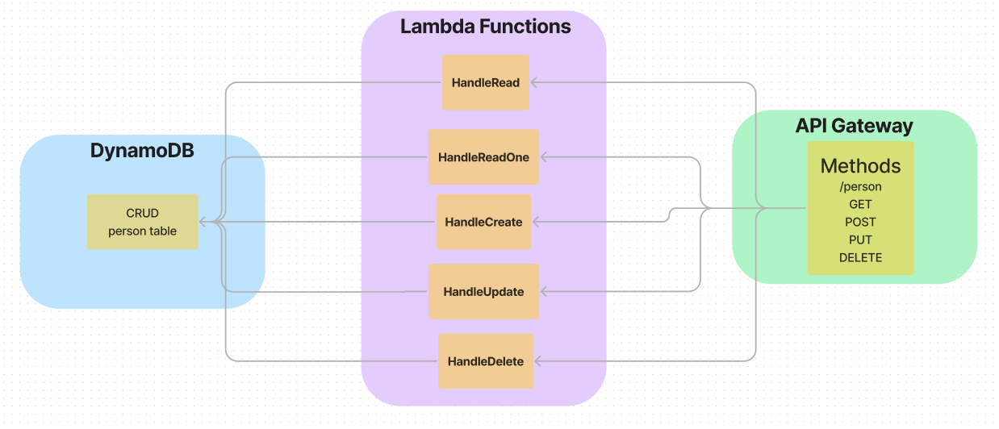

# serverless-api

AWS Lab-18

## URL

*--Add url here!--*
[]

## Routes

GET: /person

GET: /person -> id Required. response of json at id.

POST: /person -> will require a body with json. Response will be a status of 200 and message.

PUT: /person -> will require id and json. Response will be a status of 200 and message with id.

Delete: /person -> will require an id. Response will have a status code of 201 and message.

## Collaborators

- Demo Code/video  

## UML

## Notes

I have the zip files uploaded and resouces and methods setup.

**TODO**

- handleRead function.  

- handleCreate function.

- handleUpdate funmction.

- handle Delete function.  

- Make sure permissioins are setup correctly.
